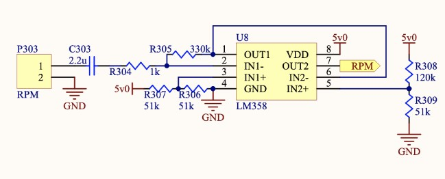

# 2019 DAQ Backend

designed by KathRen (Kathleen and Lauren)

+ [Summary](#Summary)  
    - [System Description](#system-description)  
    - [Terminology](#Terminology)  
+ [Technical Design](#Technical-Design)
    - [System Architecture](#system-architecture)
    - [Detailed Design](#detailed-design)
    - [Integration with Other Systems](#integration-with-other-systems)
+ [Design Process Reflection](#design-process-reflection)
    - [Design Considerations](#design-considerations)
    - [Timeline](#Timeline)
    - [Collaboration](#Collaboration)
+ [Conclusion](#Conclusion)
    - [Technical](#Technical)
    - [Process](#Process)

## Summary
### System Description 

The purpose of the DAQ backend is to collect data from the Battery Management System (BMS), Motor Controller (MC), GPS sensor, hall-effect sensor, potentiometer, and any other sensors as needed by the rest of the team. All data is appended with a time-stamp when received. Depending on the use of the data, some of the data is sent to a Bluetooth module that transmits the data to a phone, where the DAQ frontend receives and parses the information so that it can be displayed on a live-time dashboard or stored onto a server. The data to be used afterwards to analyze the mechanical designs is to be saved to an SD card. The general flow of data in the DAQ backend is shown in Figure 1.  

  
*Figure 1: General Flow of Information*

The intended DAQ, as shown in Figure 2, connected all of the electrical systems mentioned above. Capacitance, peak temperature, and power (from the BMS), latitude, longitude, and altitude (from the GPS), and wheel RPM (from the hall-effect sensor) were intended to be received by the frontend subsystem. The voltage (from the BMS), throttle and RPM (from the MC), and steering angle (from the potentiometer) were to be stored onto the SD card. All data, excluding the MC and potentiometer data, were to be collected by one microcontroller, which we named “Arduino 1.” The data is then parsed so that only the data needed by the frontend team was sent to the Bluetooth module. The remaining data, in this case, BMS voltage, was sent to another microcontroller, “Arduino 2,” to be saved to the SD card along with the MC and potentiometer data. The DAQ PCB (Figure 4) was designed to support all of the functions described in this section. 

  
*Figure 2: Intended Implementation*

In hopes of implementing what is shown in Figure 2, we wrote programs that allowed for SPI communication with both the BMS and MC, testing the code on Arduinos, rather than the actual microcontrollers on the BMS and MC PCB. Hypothetically, the programs should allow for the intended implementation. However, due to problems with integration, what resulted is shown in Figure 3. At competition, there was no communication with the BMS or MC, so there was no communication between the two microcontrollers on the DAQ. Thus, the DAQ frontend team only received GPS and wheel RPM. The hall effect sensor had additional issues, reading unreasonably high values, or zero. The SD card only stored potentiometer data. 

  
*Figure 3: Actual Implementation*

  
*Figure 4: DAQ PCB*

Wiring of the Microcontrollers:

PINS (Arduino 1)
+ D2 - Interrupt for RPM 
+ D4 - SS (BMS, SPI) 
+ D5 - RX (GPS, UART)   
+ D6 - TX (GPS, UART)   
+ D11 - MOSI (SPI) 
+ D12 - MISO (SPI)
+ D13 - SCK (SPI) 
+ A4 - SDA (Arduino 2, I2C)
+ A5 - SCL (Arduino 2, I2C)
+ GND - GND  
+ 5V (GPS, RPM circuit)

PINS (Arduino 2)
+ D4 - SS (SD card reader, spi)
+ D5 - SS (MC, spi)
+ D11 - MOSI (SPI) 
+ D12 - MISO (SPI)
+ D13 - SCK (SPI) 
+ A2 - Potentiometer data line
+ GND - GND  

Overall, the DAQ was able to successfully transmit some data to the dashboard, namely the GPS data, and store all the steering data for the mechanical team. Compared to last year, the main differences were the use of microcontrollers, ATMEGA328s, as compared to a RaspberryPi, and the use of the Bluetooth Module, rather than the Electron. Using the microcontrollers solved some of the communication issues that were faced last year. In particular, ATMEGA328s seem to be more friendly with I2C communication. The Bluetooth module was also quite successful in that the phone received almost all transmissions, as compared to last year when the Electron was unreliable and frequently dropped data.  The difference between the two DAQ designs is not very evident, however, since the DAQ last year was unable to be tested at competition. Ultimately, the DAQ from this year provided a good foundation for future iterations and optimizations of the current design. 

### Terminology

Arduino: a microcontroller board with breakout pins that can be programmed to send/receive data, and to perform computations  
ATMEGA328: a microcontroller chip, used frequently on Arduino boards  
Accelerometer: a device that measures acceleration in the x, y, and z directions  
Battery Management System (BMS): an electrical system in which the capacity remaining, peak temperature, power consumption, voltage of the battery will be collected and displayed on the dashboard, or saved to an SD card  
Bluetooth Smart (Low Energy): used for wireless data transfer between devices  
Central Device: the device that reads and writes data from the peripheral devices (In this case, the central device is the phone)  
Fix (relating to the GPS sensor): the GPS sensor getting a fix means that it is has found its location and is now capable of sending data about its coordinates  
Hall Effect sensor: used to calculate wheel RPM, involves a magnet at a fixed point on the wheel passing by a sensor every rotation, creating a pulse that can be seen by the DAQ  
I2C: a multi-master, multi-slave serial communication protocol that uses a clock (SCL) and data (SDA) line  
Master: device that is in unidirectional control of sending data to the slave device and requesting data from the slave   
MISO: master in, slave out  
Motor Controller (MC): an electrical system in which RPM, faults, algorithm, and throttle will be collected and displayed on the dashboard, or saved to an SD card  
MOSI: master out, slave in  
PCB: printed circuit board  
Peripheral Device: small, low power device that can connect to a more powerful central device (in this case, Arduinos act as our peripherals)    
Potentiometer: three-terminal resistor that forms an adjustable voltage divider, was used to measure and calculate steering angle   
Slave: device controlled by the master, usually receiving data  
SPI: a single master, multi-slave communication protocol that uses clock (SCLK), MOSI, MISO, and chip select (SS) lines  
UART: a serial communication protocol used for receiving and transmitting data, used by the GPS sensor  

## Technical Design 
### System Architecture 

The overall design of the DAQ can be considered inefficient, especially considering what was actually implemented at competition. Since Arduino 2 only collected potentiometer data and stored it to an SD card, the addition of this microcontroller was unnecessary as the first Arduino could have performed the same functions. Without this second ATMEGA328, the PCB could have been smaller.

However, even if the DAQ had been able to communicate with both the BMS and MC, the use of two microcontrollers may not be necessary. The main idea behind splitting the different data pipelines was to ensure that failure of one pipeline, namely the SD card writing, did not cause failure of the other, which was sending data to the phone. With more testing with the program, consolidating all the code into one program for a singular microcontroller seems possible, as Arduino 1 is already the SPI master, so writing to the SD card should not be an issue. However, it may be difficult to debug conflicts between all of the actions that the singular microcontroller may need to carry out. Another ambitious idea could be to consolidate all the code to the Bluetooth feather, which seems to have the same abilities as an Arduino board. 

### Detailed Design 

#### Positives
Communication between the DAQ backend and DAQ frontend went smoothly for the most part. There were issues with parsing data that was being sent over in batches that were not the proper length, but ultimately this was resolved. The Bluetooth module was user-friendly and reliable.   

Additionally, we found that SPI and I2C were the most reliable and easiest to implement communication protocols. When we could, we found ourselves attempting to use SPI as much as possible to eliminate room for error.  

While we had issues with getting the GPS sensor to work at first, it was able to work at competition and provided us with data that could be analyzed by the optimization team to make judgements about optimal driver strategy. Also, the potentiometer provided data about the steering angle that could be used by the MechE’s. Writing to the SD card was also successful.  

#### Troubleshooting/Debugging 
GPS sensor:  
Initially, our main issue involving the GPS sensor was due to an inability to receive a fix, which indicates that the GPS has locked onto a location. The GPS module has a red LED that pulses up and down once every second when there is no fix. When there is a fix, the LED will be off most of the time, though it will occasionally pulse.  

The GPS module requires an external antenna (there are multiple, and certain ones are better than others). (As a note, for the design for next year, we should invest in a better antenna.) Additionally, one should go outside to test and ideally it should not be too cloudy (although this depends, as it was raining/cloudy during competition and we were able to receive data). After experimenting with the module, we were then able to get the sensor working with sample code provided by Adafruit by using interrupt pin 2, and 3.  
The second issue we faced was programming Arduino 1 with a program that used the hardware UART pins 0 and 1 for GPS communication. We were informed that the “programmer was out of sync” which we discovered was a result of us trying to use the same UART pins that were being used by the Arduino programmer to upload our code.  
Even after programming the Arduino by swapping which pins we used, we ran into issues involving the GPS being fixed but data not being received by Arduino 1. As the GPS relies on UART (a serial communication), the issue turned out to be the timing and delays we were putting into the code. Essentially, as UART does not use a clock (unlike SPI and I2C), data must be sent with very accurate timing. If not, meaningless data (or no data at all) is received. Thus, it was necessary for us to poll GPS data using either a timer interrupt or a timer set up in the loop that tracks the time-stamp of the previous loop. As we were already using the interrupt pin 2 for the wheel RPM, we chose to implement the timer in the loop. Once we resolved this issue by collecting GPS data in the main loop, we then faced issues with the rest of the loop code not running. After moving the rest of the SPI and I2C code into the same timer code section that contained the GPS polling, the Arduino was able to perform all of its functions. 
Since we had planned to connect the GPS to pins 0 and 1 when designing the PCB, at competition, we had to solder the GPS sensor to pins 5 and 6 of the ATMEGA328 on the PCB, which were originally intended to be push buttons. 

#### Debugging the PCB at competition:
Programming the PCB started at competition, and there were multiple difficulties experienced at the beginning. While the programs were able to be downloaded to the board using Atmel Studio and the AVR programmer, there was a strange issue with the delay times and the speed at which the board was running. This was a problem with the clock, as the ATMEGA328s’ chip has an internal clock speed of 8 MHz which is divided by 8 as a default setting (giving us a speed of 1 MHz). I (Kathleen) was able to set the clock to not be divided, giving us 8 MHz, but this was still running at half the speed of the 16 MHz the program should be run at.  
The PCB needed an external clock of 16 MHz to run at the correct speed, which was soldered on to the board. To set the ATMEGA328 chip to use the right external clock, you must set the clock fuses as follows in Atmel Studio:  

lfuse = 0xff  
hfuse = 0xde  
efuse = 0x05  

(Warning: This should be done with caution, as if one selects the wrong external clock, the chip can not be reprogrammed and is essentially killed as it tries to operate on a clock that is not there) 
There was additional soldering needed to be done with the implementation of the potentiometer and GPS sensor (which we switched the wiring of after the PCB was ordered).

#### Data Transmission to the DAQ Frontend:
Debugging for this area mainly consisted of the issues we ran into involving parsing data. Essentially, communication protocols such as SPI are capable of sending and receiving packets of 32 characters (or bytes). However, Bluetooth is only capable of sending and receiving 20 characters. We were able to fix this in our code by splitting up our data strings. However, while we spent a decent amount of time fixing the parsing by dividing long arrays, and buffering shorter ones with empty “/” characters, the parsing from our end was not reliable enough to use as data would occasionally be dropped.  
Our final implementation is sending multiple packets of data and then having the DAQ frontend team take multiple strings, put them together, and parse from there. From our performance at competition, it appeared that this part worked smoothly and the DAQ frontend team was able to receive the data without data dropping.  

SD card:
After we understood how the SD card worked, solely implementing SD card writing was not a major concern. However, we ran into a period where we could not write to the SD card and the card could not be initialized when Arduino 2 was connected to another slave SPI device. This was mainly an issue with conflicting SPI communication with the MC and with the SD card adapter. The adapter that we had been testing with did not properly release the MISO line, so it was impossible for us to both communicate with the MC and write to the SD card at the same time. After we discovered this to be a mistake involving a nonfunctional SD card and incorrect usage of the micro SD card, we swapped out for a newer micro SD card and adapter, which resolved the problem. After we resolved this issue and implemented formatting for our data to make it easy to put into spreadsheet form, the SD card was relatively simple to work with. 

Potentiometer:

The potentiometer was used to measure the steering angle of the car. There were not many issues with it and it was wired through the bulkhead from the DAQ PCB to the end of the steering wheel of the car. It could be used as a good learning process into receiving data using analog. 

Attempted communication with the BMS and MC:
Attempted debugging of SPI communication with the BMS and MC was not fruitful. We first attempted to communicate the MC. We started using a simple program that sent a singular character to the LPCxpresso that was used on the MC board. We never progressed past this stage. The MC was unable to properly receive the character, although testing with the logic analyzer revealed that the DAQ was in fact sending the correct character. Since the priority for the MC lied in finishing the algorithms for controlling the motor, progress with the SPI communication was halted. 
When trying to communicate with the BMS, we also ran simple tests to see if the BMS could receive and send back integers. However, there seemed to be an issue with programming the BMS microcontroller, so no notable progress in integration was made. 

Wheel RPM:
The wheel RPM sensor was created by connecting a hall effect sensor to a circuit that amplified the current pulses, and then used a comparator to turn the analog signal into a digital signal. To calculate RPM, we triggered an interrupt every time there was a rising edge in the input signal. We divided the circumference of the wheel by the time it took for each revolution to find RPM. Due to noise, the sensor would sometimes trigger the interrupt unreasonably fast, so we had to filter through the values by setting a lower bound for the time interval. We did so by estimating the fastest possible speed for the car and calculating backwards for the time interval. Due to the way that we were calculating the RPM, there were also complications with extremely slow speeds, as the time that it takes for the RPM value to update is very long, and the RPM can never reach zero. To address this, we also approximated and implemented an upper time bound, in which the RPM was set to zero once this time interval was surpassed. 
At competition, we were unable to collect any useful RPM data. Upon further inspection in preparation for testing, it seems that it was a result of incorrect mounting of the hall-effect sensor. The sensor was placed in such a way that no current could be induced (parallel instead of perpendicular).  

  

(The circuit for the Hall Effect sensor is shown above)  
Things to Improve:  
Invest in a better external antenna  
More accurate wheel RPM sensor: either invest in an infrared sensor that detects the spokes of the wheel, or add several magnets so that we can detect fractions of a revolution   
Get USB ports working on PCB so we can use the serial monitor for debugging (not necessary since debugging could be done using the Bluetooth, but this would be helpful)

### Integration with Other Systems 

Positives
For the most part, communication between the Bluetooth module and the phone (DAQ frontend) went smoothly. There were a few issues with how data was being parsed, but ultimately we found that communication over Bluetooth was reliable and user-friendly. 
Negatives
We were unable to establish communication with the motor controller and battery management system, though there is definitely potential for this working in the future, as we still have the code and have confirmed that it works using Arduinos. The issues with communicating to the BMS were due to the BMS not being finished, so hopefully we could establish communication when the BMS is in a later, more completed stage.
The MC we used at competition was the one from last year, and it seems that Tim (the creator of the motor controller) did not provide a way for us to communicate with the board. The board designed by the Erics used a microcontroller different from the ones that we tested on, so successfully communicating with it was difficult. In the future, if we have a motor controller that can utilize SPI, there is potential for that communication to work. 

## Design Process Reflection 
### Design Considerations 

Before designing the DAQ, it would have been extremely useful to finalize what data is needed, and where it should be sent or stored. For instance, we had thought that the DAQ frontend team needed MC data, so our original design and program had Arduino 1 collecting both BMS and MC data using SPI. Although we did change this before ordering the PCB, we had to change a significant portion of our code, trying to add SPI code to Arduino 2. Had we tested with MC connecting with Arduino 2 earlier, we would have had more time to work on solving the SPI and SD card problem.

### Timeline

We started working on this project after joining in October, so we only wrote one report in December. At that point, we were still learning about the communication protocols and becoming familiar with coding in Arduino. A large and significant part of our progress took place during JanFab. We did face several setbacks when we wrote programs that seemed correct, but did not work when tested. We spent several days trying to communicate with the Bluetooth module, and several weeks trying to resolve issues involving writing to the SD card. 
As the DAQ backend works very closely with other electrical and software subsystems, integration testing should have started earlier. What we found out was that the programs that we had written for the BMS and MC slave devices were not easily “convertible” to code that could be programmed onto the microcontrollers on the PCBs. Thus, due to the short amount of time that we had to try to communicate with the BMS and MC, it was difficult to resolve the problems that were facing, resulting in only a half functioning DAQ. Although integration with the frontend was more painless, testing should have also started sooner. Next year’s DAQ team should dedicate at least one month towards integration. 
Another part of the project that should have been started earlier was the PCB. This part of the project was especially rushed, as the PCBs were not soldered until a week before competition. With such a short turnaround time, we were unsure if the board was even programmable, and if the code that we had written would be executed exactly how we had seen from testing on Arduinos. As a result, the board was programmed for the first time at competition, and it fortunately worked. If it had not, there would have been no reliable alternative plan, aside from connecting the Arduinos that we had been testing on with perfboards. Issues like the external clock delayed time at competition spent on debugging other pressing issues like the wheel RPM. Programming the PCBs should start around the same time as integration, or even earlier. 

### Collaboration

We worked extremely well together. Both of us shared an even amount of work, other than Kathleen attending competition and working with the PCB by herself. We found it effective to have both team members working on writing a program while bouncing ideas off of each other, and then testing and comparing the two programs. Another effective strategy is to pair program, with one person coding, while the other person suggests how to approach a problem, and checks for mistakes. 
It seems ideal to have two people working on DAQ backend, as the project requires a lot of programming and debugging. Having two people makes it easier for one person to catch the other’s mistakes and provide valuable suggestions on problems that come up. As a note, having two people working on most of the electrical system projects would be a good idea, as it makes the project more manageable and ensures that more work could be completed before competition. It provides a more balanced workload, as one might struggle to complete a project individually. 

## Conclusion
### Technical

The overall design of the system seems to operate well and has much potential for progress in the future. Next year’s DAQ team should try to optimize the current system, building off of the foundation we’ve established. It appears that having two microcontrollers, with one writing to Bluetooth and one writing to an SD card, is an effective way to structure the DAQ. The next focus should be on improved wheel RPM sensing techniques, and successful integration with the BMS and MC.

